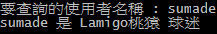
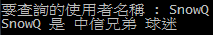
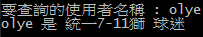
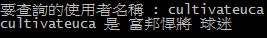

# PTT球迷預測器 (PTT Fans Predictor)

分析各版文章來預測指定ID是屬於哪一隊的球迷

## 資料
- PTT Baseball版 index 5183 ~ 184
- PTT Elephants版 index 3558 ~ 59
- PTT Monkeys版 index 3672 ~ 173
- PTT Lions版 index 3381 ~ 82
- PTT Guardians版 index 3542 ~ 43
更改 wy36101299 的 [PTTcrawler](https://github.com/wy36101299/PTTcrawler) 來抓取資料

## 使用方法
	python3 classifier.py ../data/userFeatureTest.json ../data/trainCase.txt ../data/testCase.txt

## package 需求
- sklearn version > 0.18.1
- python3

## Examples
 
 
 
 

## 方法
使用 sklearn 裡的 svm.LinearSVC() 來作為分類器
使用到的features如下:
- 各版發文數
- 各版發文推數總和
- 各版發文噓數總和
- 各版推數總和
- 各版噓數總和
共 5(feature總類數) * 5(版數) = 25 種 features

## Results
- #Train case : 90
- Training Accuracy : 1.0
- #Test case  : 40
- Testing Accuracy  : 0.95
